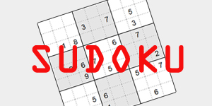
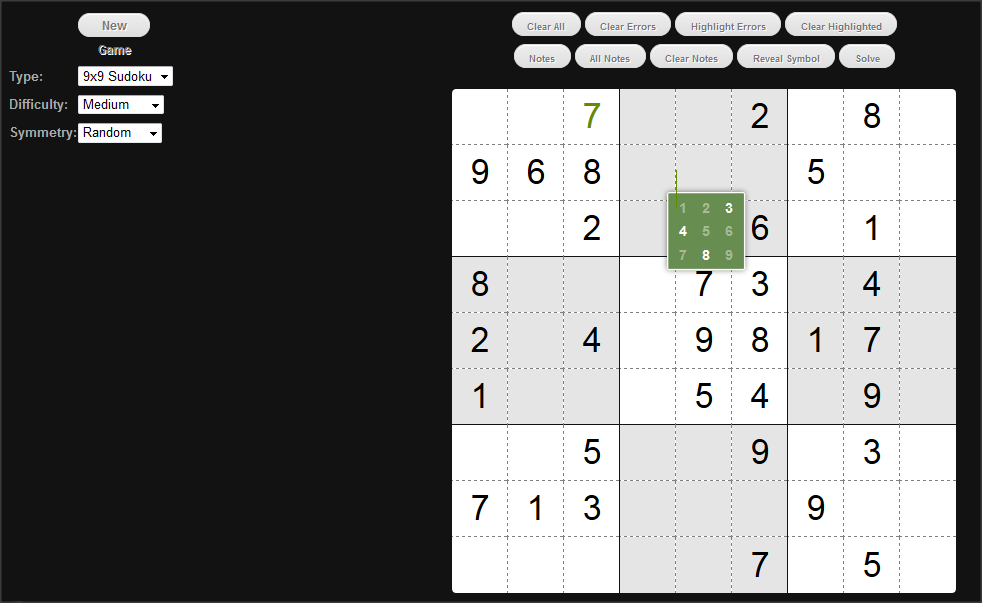

sudoku.js
=========

simple sudoku game, builder and solver,

a scaled-down version of CrossWord.js, professional Crossword Builder in JavaScript, by same author

[ISC License](https://opensource.org/licenses/ISC)

**see also:**

* [Billiard.js](https://github.com/foo123/Billiard.js) Billiard game in pure JavaScript
* [sudoku.js](https://github.com/foo123/sudoku.js) Sudoku game in pure JavaScript
* [chess.js](https://github.com/foo123/chess.js) Chess game in pure JavaScript
* [sunfish.js](https://github.com/foo123/sunfish.js) JavaScript port of Sunfish chess engine
* [Rubik3](https://github.com/foo123/Rubik3) 3D Rubik Cube game in pure JavaScript
* [3DRubikCube](https://github.com/foo123/3DRubikCube) 3D Rubik Cube game in ActionScript
